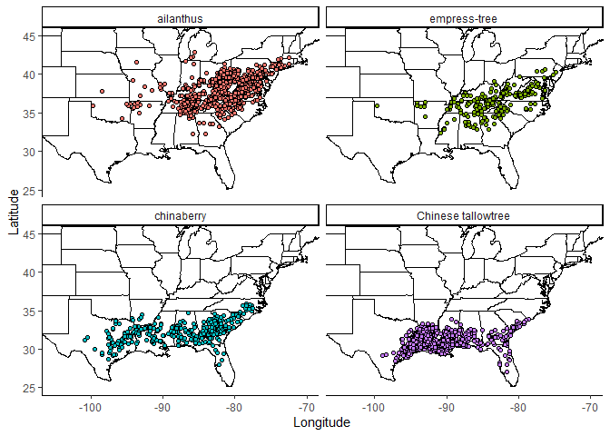

## FIA Data
First, load packages.   
[Tidyverse](https://www.tidyverse.org/)<br>
[rFIA](https://rfia.netlify.app/)

```r
library(tidyverse)
library(rFIA)
library(maps)
library(sf)
```
<br>

Set some global variables.

```r
db_dir <- 'D:/FIA/rFIA'

db_states <- c('CT','DE','IL','IN','IA','KS','ME','MD',
                     'MA','MI','MN','MO','NE','NH','NJ','NY',
                     'ND','OH','PA','RI','SD','VT','WV','WI',
                     'AL','AR','FL','GA','KY','LA','MS','NC',
                     'OK','SC','TN','VA', 'TX')

inv_spcd <- c(341, 712, 993, 994)
```
<br>

| SPCD  | Scientific Name       | Common Name        |
|:------|:--------------------- |:-------------------|
| 341   | *Ailanthus altissima* | ailanthus          |
| 712   | *Paulownia tomentosa* | empress-tree       | 
| 993   | *Melia azedarach*     | chinaberry         |
| 994   | *Triadica sebifera*   | Chinese tallowtree |

<br>

Load FIA data into an FIAdb object, making sure to use the remote database option `inMemory = F`.
The `clipFIA()` function filters db to most recent inventory cycle for each state.

```r
db <- readFIA(db_dir, states = db_states, inMemory = F) %>% clipFIA()
```
<br>

Identify plots with invasives present.

```r
inv_tpa <- tpa(db, bySpecies = T, treeDomain = SPCD %in% inv_spcd, byPlot = T)
```
<br>

Check result.

```r
inv_tpa
```

```
## # A tibble: 2,413 x 9
##     YEAR pltID        SPCD COMMON_NAME     SCIENTIFIC_NAME  PLT_CN    TPA    BAA
##    <int> <chr>       <int> <chr>           <chr>             <dbl>  <dbl>  <dbl>
##  1  2007 3_48_113_91   993 chinaberry      Melia azedarach 1.30e14 468.   15.3  
##  2  2007 3_48_15_53    994 Chinese tallow~ Triadica sebif~ 1.30e14 150.    1.97 
##  3  2007 4_48_239_82   994 Chinese tallow~ Triadica sebif~ 1.30e14 117.   12.1  
##  4  2007 5_48_29_85    994 Chinese tallow~ Triadica sebif~ 1.30e14   6.02  1.39 
##  5  2008 3_48_181_63   993 chinaberry      Melia azedarach 1.30e14 225.    2.83 
##  6  2009 2_22_97_109   994 Chinese tallow~ Triadica sebif~ 2.06e14 756.   19.0  
##  7  2009 2_22_9_89     994 Chinese tallow~ Triadica sebif~ 1.54e14   6.02  0.922
##  8  2009 3_22_11_118   994 Chinese tallow~ Triadica sebif~ 1.54e14 375.    5.07 
##  9  2009 3_22_11_49    994 Chinese tallow~ Triadica sebif~ 1.54e14 225.    2.07 
## 10  2009 3_22_39_15    994 Chinese tallow~ Triadica sebif~ 1.54e14  99.0  10.3  
## # ... with 2,403 more rows, and 1 more variable: PROP_FOREST <dbl>
```


```r
inv_vr <- vitalRates(db, bySpecies = T, treeDomain = SPCD %in% inv_spcd, byPlot = T)
inv_vr <- inv_vr %>% filter(SPCD %in% inv_spcd)
```
<br>
Get records from PLOT and COND tables for identified plots.

```r
sub_db <- readFIA(db_dir, states = db_states, tables = c('PLOT', 'COND'))
inv_cond <- sub_db$COND %>% filter(PLT_CN %in% unique(inv_tpa$PLT_CN)) %>% 
  select(PLT_CN, INVYR, STATECD, COUNTYCD, PLOT, FORTYPCD, OWNCD, OWNGRPCD, FORTYPCD, STDSZCD)
inv_plot <- sub_db$PLOT %>% filter(CN %in% unique(inv_tpa$PLT_CN)) %>%
  select(CN, PREV_PLT_CN, INVYR, LAT, LON, STATECD, COUNTYCD, PLOT, ECOSUBCD)
rm(sub_db)
```
<br>
Get unique plot IDs.

```r
plt_id <- inv_plot %>% 
  mutate(plt_id = str_c(STATECD, COUNTYCD, PLOT, sep = '_')) %>% 
  distinct(plt_id) %>% pull()
```
<br>
Attach coordinates to plots.

```r
inv_sp <- inv_tpa %>% left_join(inv_plot, by = c('PLT_CN' = 'CN')) %>% 
  select(LAT, LON, SPCD, pltID) %>% 
  mutate(SPCD = as.factor(SPCD)) %>% 
  mutate(SPCD = recode_factor(SPCD, `341` = 'ailanthus', `712` = 'empress-tree', `993` = 'chinaberry', `994` = 'Chinese tallowtree'))
```
<br>
Map it.

```r
states_lyr <- map_data("state")

ggplot() + 
  geom_polygon(data=states_lyr, aes(x=long, y=lat, group=group),
                color="black", fill="white" ) +
  labs(x = 'Longitude', y = 'Latitude') +
  geom_point(data=inv_sp, aes(x=LON, y=LAT, fill = SPCD),
             colour="black",pch=21) +
  coord_cartesian(xlim=c(-105, -70), ylim = c(25, 45)) +
  theme_classic() +
  theme(legend.position = 'none') +
  facet_wrap(~SPCD)
```

<!-- -->
<br>

## Climate Data
<br>
Load packages.

```r
library(daymetr)
library(FedData)
library(climdex.pcic)
```
<br>
Ready table of coordinates and IDs.

```r
point_tb <- inv_sp %>% select(pltID, LAT, LON) %>% distinct()
```


Function for batch point extraction from Daymet.

```r
download_daymet_batch <- function(
  point_file = NULL,
  start = 1980,
  end = as.numeric(format(Sys.time(), "%Y")) - 1,
  internal = TRUE,
  force = FALSE,
  silent = FALSE,
  path = tempdir(),
  simplify = FALSE
  ){

  # loop over all lines in the file return
  # nested list
  output <- apply(point_file, 1, function(location) {
    site <- as.character(location[1])
    lat <- as.numeric(location[2])
    lon <- as.numeric(location[3])
    
    try(download_daymet(
      site = site,
      lat = lat,
      lon = lon,
      start = start,
      end = end,
      internal = internal,
      force = force,
      silent = silent,
      path = path,
      simplify = simplify
    ),
    silent = FALSE)
  })
  
  # if the output is tidy, row bind to one big
  # tibble otherwise return a nested list
  if (simplify){
    output <- do.call("rbind", output)
  }
  
  if(internal){
    return(output)
  }
}
```
<br>
Run it.

```r
plt_clim <- download_daymet_batch(point_tb, start = 1990, end = 2020, silent = T)
```
<br>
Save output from climate pull.

```r
saveRDS(plt_clim, './Data/plt_clim_Daymet.rds')
```


```r
plt_clim <- readRDS('./Data/plt_clim_Daymet.rds')
```


<br>
Climate index function.

```r
climDex_plot <- function(siteClim = NULL)
{
  tempTB <- tibble(siteClim$data)
  startYr <- min(tempTB$year)
  endYr <- max(tempTB$year)
  clim.dates <- as.PCICt(do.call(paste, tempTB[,c('year','yday')]), 
                        format="%Y %j", cal="gregorian")
  ci <- climdexInput.raw(tempTB$tmax..deg.c., tempTB$tmin..deg.c., tempTB$prcp..mm.day., 
                        clim.dates, clim.dates, clim.dates, base.range=c(startYr,endYr))
  fd <- mean(climdex.fd(ci))
  su <- mean(climdex.su(ci))
  gsl <- mean(climdex.gsl(ci))
  r10mm <- mean(climdex.r10mm(ci))
  r20mm <- mean(climdex.r20mm(ci))
  rx5day <- mean(climdex.rx5day(ci, freq = 'annual'))
  sdii <- mean(climdex.sdii(ci))
  droughtlen <- mean(spell.length.max(ci@data$prec, ci@date.factors$annual, 5, "<=", TRUE))
  outDF = tibble(SITE = siteClim$site, FD=fd, SU=su, GSL=gsl, R10MM=r10mm, 
                 R20MM=r20mm, RX5DAY=rx5day, SDII=sdii, DROUGHTLEN=droughtlen)
  return(outDF)
}
```
<br>
Get climate indices for all plots.

| Index | Description       |
|:------|:--------------------- |
| FD   | Number of frost days |
| SU   | Number of summer days |
| GSL   | Growing season length     |
| R10mm   | Annual count of days when PRCP ≥ 10mm   |
| R20mm   | Annual count of days when PRCP ≥ 20mm   |
| Rx5day   | Maximum consecutive 5-day precipitation   |
| SDII   | Simple precipitation intensity index   |
| DL   | Number of consecutive days when PRCP <= 5mm   |
<br>

```r
climInd <- plt_clim %>% purrr::map(~ climDex_plot(.x)) %>% 
  map_dfr(~ .)
```


```r
write_csv(climInd, './Data/Plot_ClimIndex.csv')
```

