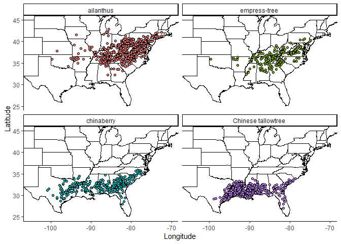

FIA Invasive Species Analysis
================

First, load packages.  
[Tidyverse](https://www.tidyverse.org/)<br>
[rFIA](https://rfia.netlify.app/)

``` r
library(tidyverse)
library(rFIA)
library(maps)
```

    ## Warning: package 'maps' was built under R version 4.1.3

``` r
library(sf)
```

<br>

Set some global variables.

``` r
db_dir <- 'D:/FIA/rFIA'

db_states <- c('CT','DE','IL','IN','IA','KS','ME','MD',
                     'MA','MI','MN','MO','NE','NH','NJ','NY',
                     'ND','OH','PA','RI','SD','VT','WV','WI',
                     'AL','AR','FL','GA','KY','LA','MS','NC',
                     'OK','SC','TN','VA', 'TX')

inv_spcd <- c(341, 712, 993, 994)
```

<br>

| SPCD | Scientific Name       | Common Name        |
|:-----|:----------------------|:-------------------|
| 341  | *Ailanthus altissima* | ailanthus          |
| 712  | *Paulownia tomentosa* | empress-tree       |
| 993  | *Melia azedarach*     | chinaberry         |
| 994  | *Triadica sebifera*   | Chinese tallowtree |

<br>

Load FIA data into an FIAdb object, making sure to use the remote
database option `inMemory = F`. The `clipFIA()` function filters db to
most recent inventory cycle for each state.

``` r
db <- readFIA(db_dir, states = db_states, inMemory = F) %>% clipFIA()
```

<br>

Identify plots with invasives present.

``` r
inv_tpa <- tpa(db, bySpecies = T, treeDomain = SPCD %in% inv_spcd, byPlot = T)
```

<br>

Check result.

``` r
inv_tpa
```

    ## # A tibble: 2,413 x 9
    ##     YEAR pltID        SPCD COMMON_NAME     SCIENTIFIC_NAME  PLT_CN    TPA    BAA
    ##    <int> <chr>       <int> <chr>           <chr>             <dbl>  <dbl>  <dbl>
    ##  1  2007 3_48_113_91   993 chinaberry      Melia azedarach 1.30e14 468.   15.3  
    ##  2  2007 3_48_15_53    994 Chinese tallow~ Triadica sebif~ 1.30e14 150.    1.97 
    ##  3  2007 4_48_239_82   994 Chinese tallow~ Triadica sebif~ 1.30e14 117.   12.1  
    ##  4  2007 5_48_29_85    994 Chinese tallow~ Triadica sebif~ 1.30e14   6.02  1.39 
    ##  5  2008 3_48_181_63   993 chinaberry      Melia azedarach 1.30e14 225.    2.83 
    ##  6  2009 2_22_97_109   994 Chinese tallow~ Triadica sebif~ 2.06e14 756.   19.0  
    ##  7  2009 2_22_9_89     994 Chinese tallow~ Triadica sebif~ 1.54e14   6.02  0.922
    ##  8  2009 3_22_11_118   994 Chinese tallow~ Triadica sebif~ 1.54e14 375.    5.07 
    ##  9  2009 3_22_11_49    994 Chinese tallow~ Triadica sebif~ 1.54e14 225.    2.07 
    ## 10  2009 3_22_39_15    994 Chinese tallow~ Triadica sebif~ 1.54e14  99.0  10.3  
    ## # ... with 2,403 more rows, and 1 more variable: PROP_FOREST <dbl>

``` r
inv_vr <- vitalRates(db, bySpecies = T, treeDomain = SPCD %in% inv_spcd, byPlot = T)
inv_vr <- inv_vr %>% filter(SPCD %in% inv_spcd)
```

<br> Get records from PLOT and COND tables for identified plots.

``` r
sub_db <- readFIA(db_dir, states = db_states, tables = c('PLOT', 'COND'))
inv_cond <- sub_db$COND %>% filter(PLT_CN %in% unique(inv_tpa$PLT_CN)) %>% 
  select(PLT_CN, INVYR, STATECD, FORTYPCD, OWNCD, OWNGRPCD, FORTYPCD, STDSZCD)
inv_plot <- sub_db$PLOT %>% filter(CN %in% unique(inv_tpa$PLT_CN)) %>%
  select(CN, PREV_PLT_CN, INVYR, LAT, LON, STATECD, ECOSUBCD)
```

<br> Attach coordinates to plots.

``` r
inv_sp <- inv_tpa %>% left_join(inv_plot, by = c('PLT_CN' = 'CN')) %>% 
  select(LAT, LON, SPCD) %>% 
  mutate(SPCD = as.factor(SPCD)) %>% 
  mutate(SPCD = recode_factor(SPCD, `341` = 'ailanthus', `712` = 'empress-tree', `993` = 'chinaberry', `994` = 'Chinese tallowtree'))
```

<br> Map it.

``` r
states_lyr <- map_data("state")

ggplot() + 
  geom_polygon(data=states_lyr, aes(x=long, y=lat, group=group),
                color="black", fill="white" ) +
  labs(x = 'Longitude', y = 'Latitude') +
  geom_point(data=inv_sp, aes(x=LON, y=LAT, fill = SPCD),
             colour="black",pch=21) +
  coord_cartesian(xlim=c(-105, -70), ylim = c(25, 45)) +
  theme_classic() +
  theme(legend.position = 'none') +
  facet_wrap(~SPCD)
```

<!-- -->
<br>
